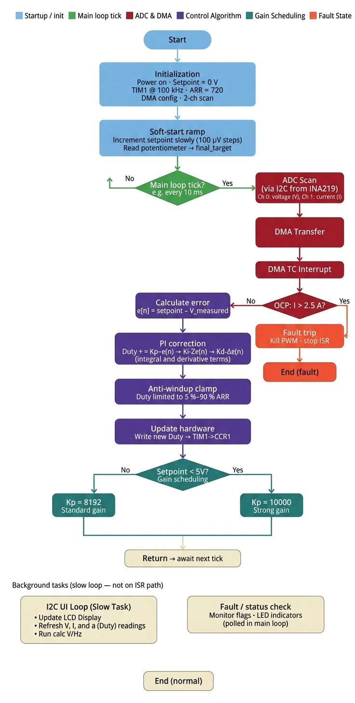

CLOSED-LOOP CONTROL FIRMWARE
## Digital Variable Power Supply | Omolo Design

This repository contains the high-performance, bare-metal firmware for a digitally controlled buck converter. Designed for the **STM32F103 (Blue Pill)**, it implements precise voltage regulation and high-speed protection for a discrete power stage.

---

 HARDWARE SPECIFICATIONS
| Parameter | Value |
| :--- | :--- |
| **Input Voltage** | 19.5V DC |
| **Output Range** | 0V – 15V (Variable) |
| **Current Limit** | 2.0A Max Output |
| **Topology** | Asynchronous Buck |
| **Switching Freq** | 100 kHz (via TIM1) |
| **Feedback IC** | INA219 (High-Side I2C) |

---

 FIRMWARE ARCHITECTURE
The system employs a **Proportional-Integral (PI)** controller optimized for power electronics. Key logic includes high-speed sampling via the INA219 and dynamic gain adjustment to ensure stability across the full variable output range.

System Control Flow

Core Control Features

**Soft-Start Ramp** Prevents massive inrush currents by incrementally stepping the setpoint in 100 µV intervals until the target voltage is reached.

**Anti-Windup Clamping** Protects the control loop from integral saturation by strictly limiting the PWM duty cycle between 5% and 90% of the Auto-Reload Register (ARR).

**Gain Scheduling** Dynamically switches proportional gain ($K_p$) based on the setpoint. A stronger gain ($K_p = 10000$) is automatically applied for setpoints below 5V to maintain a fast transient response, while standard gain ($K_p = 8192$) is used for higher voltages.

**Over-Current Protection (OCP)** A dedicated safety interrupt that triggers a "Fault Trip" if the INA219 detects current exceeding 2.5A, instantly killing the PWM signal to protect the MOSFETs and load.

---
  REPOSITORY STRUCTURE
* **Core/** — Bare-metal source code and low-level register headers.
* **Drivers/** — CMSIS and hardware-specific peripheral drivers.
* **Hardware/** — KiCad schematic and PCB design files.

---

 ROADMAP
* **Full PID Implementation:** Adding derivative term for improved overshoot control.
* **Telemetry:** Integration of an I2C OLED display for live V/I monitoring.
* **Remote Interface:** UART-to-PC GUI for automated testing and logging.

---
**© 2026 Omolo Design**
